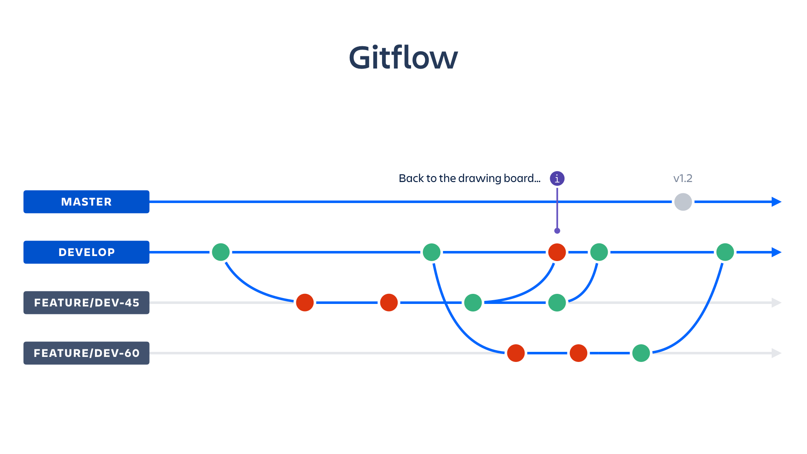

## [ESPERANZA DE VIDA AL NACER](https://github.com/soyHenry/PF_DS/blob/main/Proyectos/Esperanza%20de%20Vida%20al%20Nacer.md)

## Consignas
* Para la elaboración de este proyecto, deben **situarse en el rol de una consultora de datos**. Nuestro potencial cliente desea **conocer los distintos factores que tienen incidencia en el resultado del indicador** y, a su vez, cómo se manifiestan cada uno de ellos.
* Al momento de abordarlo, tendrán que trabajar con la **fuente de datos brindada por el Banco Mundial**. Allí podrán encontrar diversas bases de datos para cada uno de los indicadores detallados en la página. Se espera que, como mínimo, utilicen 10 datasets.
    * (Fuente de base del Banco Mundial)[https://databank.worldbank.org/databases]
    * 
* Asimismo, es un requisito que **exploren otras fuentes de datos externas a la del Banco Mundial** de su interés que puedan complementar los análisis que se desprendan de los datasets elegidos. *???A su vez, deben explorar la implementación de una API para poder traerse todos los datos elegidos de la base del Banco Mundial.???*
* Como sugerencia, es menester **descartar la contemplación de factores biológicos** en la esperanza de vida. **La esencia del proyecto radica en considerar aquellos factores socioeconómicos que ejercen una influencia en dicha esperanza**.
* Por otra parte, y como apartado opcional para enriquecer aún más su trabajo, **se pueden tomar en cuenta aspectos inherentes a cuestiones culturales, hábitos humanos, acceso a la salud, brecha de género, entre otras índoles**.
* Tendrán la libertad de delimitar su proyecto en el espacio y tiempo que estimen pertinentes. Esto quiere decir que la elección de los Estados con los que van a realizar el estudio, así como el periodo temporal abarcado, queda a disposición del grupo. Aunque, como siempre, hay un “pero”. Un gran poder conlleva una gran responsabilidad, por lo tanto se espera que, **como mínimo, trabajen con 30 Estados y un periodo temporal no menor a 30 años**.

### Situación Actual
* En un estudio en 1965 el profesor de economía George J. Stolnitz mostro que la supervivencia (esperanza de vida) en los países en vias de desarrollo estaba en aumento debido a una disminución en la miseria económica.
* En 1975 Samuel Preston publico un estudio donde produjo un diagrama de dispersión entre la esperanza de vida y el ingreso per cápita que se conviertio en una de las ilustraciones más importantes para un periodo entre 1900 y 1960. El diagrama demostro que los factores exógenos al nivel actual de un país representa el 75-90% del crecimiento de la esperanza de vida.
* Preston identificó que los factores  que vacunas, antibióticos y sulfonamidas (antibióticos para enfermedades infecciosas) en áreas más desarrolladas y el control de insectos, el saneamiento, la educación para la salud y los servicios de salud maternoinfantil en áreas menos desarrolladas como los principales factores que contribuyeron al aumento de la esperanza de vida.
* Thomas McKeown publicó dos libros que argumentaban esencialmente lo contrario: que los patrones de mortalidad tienen todo que ver con el crecimiento económico y los niveles de vida. Pritchett y Summers argumentaron en 1996 que el crecimiento del ingreso nacional alimenta naturalmente una mejor educación y servicios de salud, que a su vez contribuyen a una mayor esperanza de vida.
* En el estudio realizado por Shaw, Horrace y Vogel en el 2005, encontramos que duplicar los gastos farmacéuticos anuales agrega aproximadamente un año de esperanza de vida en hombresa a los 40 años y un poco menos de un año de esperanza de vida para las mujeres a los 65 años. También presento como por ejemplo, disminuir el consumo de tabaco en aproximadamente dos cigarrillos por día o aumentar el consumo de frutas y verduras en un 30% (un tercio de libra por día) aumenta la esperanza de vida de aproximadamente un año para las mujeres de 40 años.
* El estudio empírico desarrollado en el trabajo realizado por *David Rodríguez Rodríguez titulado La relación entre esperanza de vida, desarrollo económico y medio ambiente en el 2015* muestra la existencia de una relación lineal directa entra la esperanza de vida de los países y su nivel de calidad ambiental, pero con un coeficiente de determinación reducido que, además, va disminuyendo a medida que se analizan grupos de paises con niveles de renta decrecientes.

### Factores
1. Socio económico 
    * Países desarrollados (Ambientales, estilo de vida, sanitarios y de salud).
        - Ambientales como la Riqueza, educación, seguridad, regulación, infraestructuras.
        - Estilo de vida como el consumo de tabaco, consumo de alcohol, hábitos de alimentación.
        - Factores sanitarios y de salud como por ejemplo el gasto farmacéutico y el gasto sanitario no farmacéutico.
    * Países subdesarrollados (Economía, tasa de alfabetización, alimentación y régimen político)
        - Determinantes directos (PIB per cápita, tasa de alfabetización, tasa de urbanización y localización tropical)
        - Determinantes indirectos (tasa de fertilidad, nutrición, agua potable y gasto sanitario)
            - A medida que disminuye la tasa de fertilidad de las mujeres, su esperanza de vida aumenta, a la vez que disminuyen los riegos tanto para la madre como para el niño asociados al embarazo, parto y postparto.
            - El caso de la nutrición arroja, también, un resultado positivo en este tipo de países, pero a medida que aumenta el consumo de productos de origen animal llega un punto, a partir del cual, su influencia se vuelve negativa.
            - 
2. Calidad ambiental
    * Determina que la salud: el aire, la contaminación del agua, el agotamiento de los recursos naturales, el deterioro de los suelos… son capaces de incrementar la mortalidad humana.
3. 
### Objetivos
Somos una empresa de soluciones Businees Intelligence y Servicios de Big Daga con una gran experiencia para empresas privadas nacionales y extrangeras con projectos para conpañias como Spotify, Netflix, AWS y Tesla.
1. Vision
2. Mision
3. Valores
El logro principal que la empresa quiere conseguir con su proyecto, es **conocer los factores socieconomicos que tienen incidencia en el resultado del indicador esperanza de vida al nacer y como y porque se manificiestan estas variables** de los ultimos 30 y de los países que tengan la información requerida.
### Alcance
La data propuesta sera del Banco Mundial de los países que cumplan con el criterio de información requerida, en los ultimos 30 años hasta el 2020.
### Stack Tecnológico
Desde análisis de comportamiento, previsión y regresión de consumo hasta la limpieza y tratamiento de cualquier tipo de datos, puede confiar en nosotros para cualquier servicio de Big Data. Con infraestructuras especializada para el manejo y mantenimiento del producto. Como con la 
### Soculión propuesta
Quermos brindar una plataforma de diseño responsive, intuitiva y personalizada, rapida y facil de usar con mensajes de ayuda claros y directos, con una escalabildad tanto horizontal (Cantidad de data que pueda adminstrar) como vertical (Fulcionalidades requeridas). Con las siguientes características:
* Analisis y soporte de una la base de datos del Banco Mundial.
* Extracción de datos complementarios de diferentes fuentes. (APIs)
* Análisis estadístico para encontrar los principales factores con mayor influencia.
* Utilizar herramientas de preprocesamiento (PowerBI) para mostrar los resultados requeridos por la empresa.
* Generar modelos predictivos para analizar y responder a futuros escenarios.
### Metodologia de trabajo
SCRAM
### Entregables ()
### Equipo (Roles)
Con un equipo de profesionales multidisciplinario y multicultural con diferentes especialidades presento:
1. Business Data Analytics Ravi Rojas
    * Es quien recoge las necesidades de negocio de los usuarios para mostrárselas al equipo e igualmente es quien presenta los resultados obtenidos del análisis y modelado de los datos.
    * El rol es mucho más singular, ya que debe combinar el conocimiento de negocio con una competencia técnica suficiente para comprender los problemas y enfoques de la ciencia de datos.
    * Su mayor responsabilidad es ser un interfaz eficaz entre el equipo y las expectativas del negocio.
2. Data Analyst Mariel Cochachi.
    * Es un profesional con un alto desarrollo innovador, ya que debe ser capaz de ver las cosas desde una perspectiva muy distinta a la de sus compañeros.
    * Son los responsables de crear gráficos y herramientas visuales para lograr que todas las personas de la organización comprendan los datos de una manera más fácil.
3. Data Scientist Jorge Alarcon
    * Combinan una serie de habilidades multidisciplinarias que van entre matemáticas, informática, estadística, comunicación y negocios. 
    * Su mayor responsabilidad es extraer conocimiento y ayudar con él a diseñar productos basados en el análisis de los datos obtenidos, todo esto lo logra explorando, creando y experimentando con modelos y visualizaciones. 
4. Data Engineer Domingo Gutierrez.
    * Estas personas son expertas en la estructura de la Big Data, por tal motivo son las encargadas de proporcionarle al equipo de trabajo, los datos de una manera más accesible y apropiada. 
    * La responsabilidad del Data Engineer preparar todo el ecosistema para que los demás puedan obtener sus datos limpios y preparados para el análisis. En su día a día debe conocer cómo se modelan los datos y además tener un amplio conocimiento de SQL.
5. Data Steward
    * Su rol principalmente está relacionado con el monitoreo, operación y mantenimiento de la base de datos. Se encarga de mantener la calidad, disponibilidad, seguridad y mejorar el almacenamiento y presentación de los datos al usuario.
    * Entre sus responsabilidades encontramos comprender las necesidades del usuario, monitorear el desempeño de la base de datos, redefinir el diseño, instalar y probar programas, planificar y conservar un sistema de respaldo, otorgar permiso a los usuarios, supervisar la labor de personas encargadas de subir información a la base de datos, entre otros. 

### Cronograma

A través de la Curva de Preston, se puede establecer una relación empírica entre el PIB per cápita y la esperanza de vida

### Info
* [Roles y Responsabilidades de un Científico de Datos](http://www.thepumphandle.org/2013/04/01/economic-development-and-mortality-samuel-prestons-1975-classic/)
* [Article by Sara Gorman](http://www.thepumphandle.org/2013/04/01 economic-development-and-mortality-samuel-prestons-1975-classic/)
* [The Determinants of Life Expectancy: An Analysis of the OECD Health Data (2005)](https://www.jstor.org/stable/20062079?read-now=1&seq=15#page_scan_tab_contents)
* [Barlow y Vissandjée (1999)](https://www.researchgate.net/figure/Regression-analysis-of-national-life-expectancy-at-birth-1990_tbl1_233360418)
* [Tesis base](https://ruc.udc.es/dspace/bitstream/handle/2183/16409/RodriguezRodriguez_David_TFG_2015.pdf?sequence=2)

## Data Pipeline

Nuestro staff está altamente capacitado en diferentes tecnologías y con diferentes backgrounds lo que nos da un marco de trabajo seguro, estable y escalable, tenemos desde expertos en la extracción y producción de los datos, hasta expertos en la calidad de los resultados finales consumidos por el producto.

Para el siguiente trabajo vamos a tener la siguiente arquitectura:

1. Nuestro equipo trabaja bajo un sistema de control de versiones Git en una de las plataformas más usadas por los desarrolladores, esto para garantizar un mantenimiento constante y/o un sistema ramificado para mantener un plan de entregas iterativas del proyecto.

2. El lenguaje de programación más usado por nuestra empresa es Python, ya que al ser multiparadigma y orientado a objetos es uno de los más usados en DataScience.

3. Nuestra organización también tiene un equipo de DevOs especializado en la automatización de entregas el cual planifica, construye, testea, libera, despliega y monitorea el proyecto, usualmente usamos Docker con la capacidad de dar respuesta a cualquier Sistema Operativo y/o servicio en la nube.

4. La información se extraerá mediante APIs de entidades de gran confiabilidad como Banco Mundial y se complementará con otras fuentes como UNICE o la ONU entre otras, estos datos limpios serán subidos a una nuve como AWS, Linode o Azure, por la calidad de los datos se plantea usar una base de datos PostgreSQL y con forma evoluciona en complejidad el proyecto podríamos migrar a una base de datos mongo.

5. La metodología para este proyecto es SCRUM, esto quiere decir que el Analista Funcional definirá un documento que contiene todos los requisitos del proyecto, luego en una reunión junto con el equipo de desarrollo se planificarán algunas soluciones. En el corazón del SCRUM se desarrollará el proyecto según la necesidad del cliente, tanto si fuese incremental o funcional, las revisiones y feedback del dueño del proyecto son esenciales para las continuas entregas.

6. Todas estas tecnologías y metodologías con el fin de desarrollar un proyecto de DataSciense aplicado al contexto social **"Esperanza de Vida al Nacer"** en el cual se aplicará modelos de Machine learning, mi compañero Ravi Rojas les describira las caracteristicas del producto.

el kpi es una metrica con un objetivo en particular, 